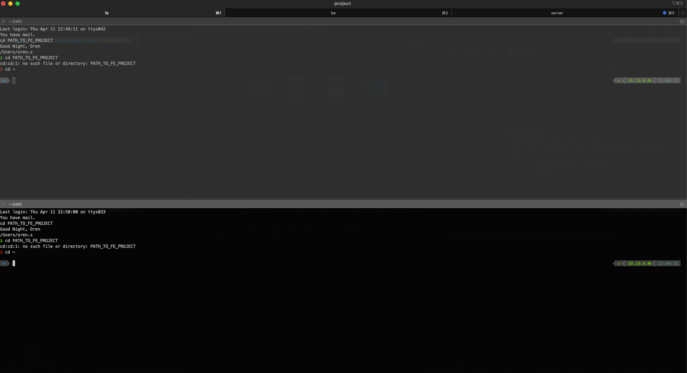

## iTerm2 tabs script

This repo shows how to implement the iTerm2 tabs script in Python3. The script is used to open multiple tabs in iTerm2 and run commands in each tab.

It utilizes the [iTerm2 python API](https://iterm2.com/python-api/)

### Usage

1. Copy the `project.py` file the iTerm2 dedicated `Scripts` directory: `$HOME/Library/ApplicationSupport/iTerm2/Scripts`.

2. Edit the `project.py` file to configure the desired tabs and commands:
   1. Change the `window_title` variable value to control the window title.
   2. Edit the `tabs` array: (_each tab is split to top and bottom panes in which you can run commands_)
      1. It includes the props `title`, `top` and `bottom`.
      2. `title` controls the tab title.
      3. `top` controls the command to run in the top pane.
      4. `bottom` controls the command to run in the bottom pane.

3. Test it by running the script:
   ```bash
   python3 project.py
   ```
The script should open iTerm2 and run the commands in each tab.



__Optional - add alias to shell__

You can add an alias to your shell to run the script from anywhere.

Add the following line to your shell profile file (e.g. `~/.bash_profile`, `~/.zshrc`):
```bash
alias iterm2tabs='python3 $HOME/Library/ApplicationSupport/iTerm2/Scripts/project.py'
```

Then you can run the script from anywhere by typing `iterm2tabs`.

_More options included in the [iTerm2 python API docs](https://iterm2.com/python-api/tutorial/running.html)_